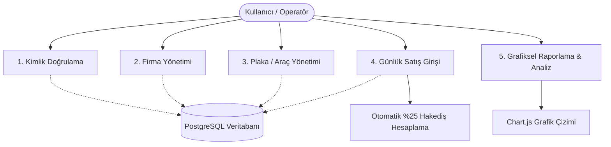

# Yazılım Gereksinim Şartnamesi (Software Requirements Specification - SRS)

## Proje Adı: Plaka Takip Sistemi

---

## 1. Giriş (Introduction)

### 1.1 Amaç (Purpose)
Bu doküman, Plaka Takip Sistemi (PTS) için işlevsel (functional) ve işlevsel olmayan (non-functional) gereksinimleri tanımlamaktadır. Dokümanın amacı, geliştirici ekipler, test uzmanları ve proje sahipleri için uygulamanın ne şekilde çalışacağına dair net, doğrulanabilir ve eksiksiz bir referans oluşturmaktır.

### 1.2 Kapsam (Scope)
Plaka Takip Sistemi, turizm/seyahat organizasyonlarında anlaşmalı araçların turlara katılımından doğan günlük satış cirolarını ve hak ediş (komisyon) ödemelerini takip eden web tabanlı bir yönetim yazılımıdır. 
Sistem şunları kapsar:
* Çok kullanıcılı oturum yönetimi ve verilerin kullanıcı bazlı izolasyonu.
* Anlaşmalı firmaların ve bu firmalara kayıtlı araçların (plaka bazlı) yönetimi.
* Günlük ciro verilerinin girişi ve bunlardan otomatik hak ediş (%25 oranında) hesaplanması.
* Detaylı grafiksel analizler (pasta ve sütun grafikleri) içeren performans raporları.

### 1.3 Tanımlar ve Kısaltmalar (Definitions & Acronyms)
* **Kullanıcı (Operatör):** Sistemi kullanan, günlük plaka girişi yapan ve raporları inceleyen yetkili personel.
* **Hak Ediş (Commission):** Araçların turlarda gerçekleştirdiği satış cirosunun tur operatörüne / sisteme kalan %25'lik komisyon payı.
* **Net Ciro (Net Revenue):** Toplam Satış Miktarı ile Hak ediş arasındaki farkı (Ciro - Hak ediş = %75'lik pay) ifade eder.
* **Soft Delete:** Veritabanındaki satırların kalıcı olarak silinmeyip, bir `aktif` bayrağı (boolean) ile pasifleştirilerek geçmiş veri bütünlüğünün korunması tekniği.
* **SPA (Single Page Application):** Tek bir HTML sayfası üzerinde çalışan, sayfa yenilenmeden dinamik içerik güncellemeleri yapan web uygulama mimarisi.

---

## 2. Genel Açıklama (Overall Description)

### 2.1 Ürün Perspektifi (Product Perspective)
Plaka Takip Sistemi, istemci-sunucu (Client-Server) mimarisinde çalışan, bağımsız bir web uygulamasıdır. Sunucu tarafı Express.js web framework'ü ve PostgreSQL veritabanı ile verileri yönetirken; istemci tarafı Vanilla JavaScript ve Chart.js kullanarak modern ve hızlı bir arayüz sunar. Uygulama, bulut platformu (örn. Render) üzerinde veya yerel ağ sunucularında konuşlandırılabilir.

### 2.2 Ürün Fonksiyonları (Product Functions)
Sistem temel düzeyde şu üst seviye fonksiyonları yerine getirir:
1. **Oturum Yönetimi:** Kullanıcı kaydı, şifreli giriş (`bcrypt`), oturumu sonlandırma.
2. **Firma Yönetimi:** Yeni firma ekleme, mevcut firmaları listeleme, firma durumunu pasifleştirme (Soft Delete).
3. **Araç Yönetimi:** Firmaya bağlı yeni plaka tanımlama, plakaları listeleme, pasifleştirme.
4. **Kayıt Yönetimi:** Tarih ve plaka bazlı satış rakamı ekleme, hakediş hesaplama, kayıtları silme.
5. **Raporlama ve Analiz:** Plaka bazlı, firma bazlı ve tarih aralıklı ciro analizi ve grafik üretimi.

### 2.3 Kullanıcı Sınıfları ve Özellikleri (User Classes & Characteristics)
* **Sistem Yöneticisi / Operatör:** Sisteme kaydolmuş tüm kullanıcılar kendi alanlarının "yöneticisidir". Bir kullanıcının girdiği hiçbir veri (firma, araç, ciro kaydı) bir başka kullanıcı tarafından görüntülenemez veya değiştirilemez. 
* Kullanıcıların asgari düzeyde bilgisayar ve tarayıcı kullanma becerisine sahip olduğu varsayılır.

### 2.4 Tasarım ve Geliştirme Kısıtlamaları (Design & Development Constraints)
* **Kütüphane Kısıtları:** Arayüzün hafif ve hızlı kalması amacıyla ağır CSS frameworkleri (TailwindCSS, Bootstrap) yerine özel yazılmış Vanilla CSS kullanılacaktır.
* **Tarayıcı Uyumluluğu:** İstemci tarafı HTML5 ve ES6 standartlarını destekleyen modern tarayıcılarda (Chrome, Firefox, Safari, Edge) sorunsuz çalışmalıdır.
* **Veritabanı Kısıtları:** İlişkisel veri bütünlüğünü (Foreign Key constraints) korumak adına ilişkisel bir veritabanı (PostgreSQL) tercih edilmiştir.

---

## 3. Sistem Özellikleri (System Features / Functional Requirements)

### 3.1 Üyelik ve Kimlik Doğrulama Modülü
* **Gereksinim 3.1.1 (Kayıt Olma):** Ziyaretçiler benzersiz bir kullanıcı adı ve şifre belirleyerek sisteme kaydolabilmelidir. Şifreler veritabanına açık metin olarak değil, `bcryptjs` algoritması ile tuzlanarak (salt) şifrelenmiş halde kaydedilmelidir.
* **Gereksinim 3.1.2 (Giriş Yapma):** Kayıtlı kullanıcılar kullanıcı adı ve şifreleri ile sisteme giriş yapabilmelidir. Başarılı girişte kullanıcı bilgileri istemci tarafında (`localStorage`) oturum süresince saklanmalıdır.
* **Gereksinim 3.1.3 (Güvenlik Kontrolü):** Giriş yapmamış kullanıcılar uygulamanın ana panelini (App Shell) görüntüleyemez, doğrudan giriş sayfasına yönlendirilir.

### 3.2 Firma ve Araç (Plaka) Yönetimi Modülü
* **Gereksinim 3.2.1 (Firma Tanımlama):** Kullanıcı yeni bir tur firması ismi girerek firmayı kaydedebilmelidir. Firma adları otomatik olarak büyük harfe dönüştürülmelidir.
* **Gereksinim 3.2.2 (Araç Tanımlama):** Kullanıcı, önceden tanımlanmış aktif firmalardan birini seçerek yeni bir plaka (Örn: `34ABC123`) kaydedebilmelidir. Plaka karakterleri boşluksuz ve büyük harf olacak şekilde normalize edilmelidir.
* **Gereksinim 3.2.3 (Güvenli Silme - Soft Delete):** 
  * Bir firma silindiğinde veritabanından kalıcı olarak yok edilmez, `aktif` alanı `FALSE` yapılır. 
  * Firma pasifleştiğinde, o firmaya bağlı tüm araçlar da otomatik olarak pasif (`aktif = FALSE`) duruma getirilmelidir.
  * Pasif araçlar günlük veri giriş ekranlarında ve araç listelerinde listelenmemelidir ancak geçmiş raporlarda ciro hesaplamalarına dahil edilmeye devam etmelidir.

### 3.3 Günlük Satış ve Hakediş Girişi Modülü
* **Gereksinim 3.3.1 (Satış Girişi):** Kullanıcı, aktif araç plakalarından birini seçerek satış tarihi ve satış miktarını (TL) girmelidir.
* **Gereksinim 3.3.2 (Hakediş Hesaplama):** Girilen satış miktarının tam olarak **%25'i** oranında hakediş hesaplanmalıdır. (Formül: $Hakedis = Satis \times 0.25$). Hesaplanan değer virgülden sonra en fazla iki basamak olacak şekilde yuvarlanmalıdır.
* **Gereksinim 3.3.3 (Kayıt Silme):** Hatalı girilen günlük kayıtlar silinebilmelidir. Silme işleminde ciro tablosu ve günlük toplamlar anlık olarak güncellenmelidir.

### 3.4 Analitik ve Gelişmiş Raporlama Modülü
* **Gereksinim 3.4.1 (Plaka Bazlı Rapor):** Belirli bir plakanın iki tarih arasındaki tüm girişleri listelenmeli ve ciro dağılımları seçilen periyoda (günlük, aylık, yıllık) göre **Çizgi/Alan (Line) Grafiği** şeklinde görselleştirilmelidir.
* **Gereksinim 3.4.2 (Firma Bazlı Rapor):** Belirli bir firmaya ait araçların yaptığı toplam satışlar ve hakedişler seçilen periyotta gruplanarak listelenmeli ve grafiğe aktarılmalıdır.
* **Gereksinim 3.4.3 (Tarih Bazlı Ciro Dağılımı):**
  * Seçilen tarih aralığında elde edilen toplam Net Ciro hesaplanmalıdır.
  * Firmaların toplam cirodaki pay yüzdeleri **Daire (Pie) Grafiği** ile gösterilmelidir.
  * Net cironun aylık bazdaki gelişim trendi **Sütun (Bar) Grafiği** ile gösterilmelidir.

---

## 4. Dış Arayüz Gereksinimleri (External Interface Requirements)

### 4.1 Kullanıcı Arayüzü (User Interface)
* Arayüz responsive tasarıma sahip olmalıdır. Mobil cihazlarda, tabletlerde ve masaüstü bilgisayarlarda tam uyumlu çalışmalıdır.
* Koyu renkli profesyonel bir sol menü (Sidebar) ve sağ tarafta ana çalışma alanını içeren iki bölmeli yerleşim kullanılmalıdır.
* Hatalı işlemlerde kırmızı renkte uyarı mesajları, başarılı işlemlerde yeşil renkte bilgilendirmeler kullanıcıya gösterilmelidir.

### 4.2 Donanım Arayüzleri (Hardware Interfaces)
* İstemci cihazlarında özel bir donanım gereksinimi yoktur. İnternet bağlantısına ve modern bir web tarayıcısına sahip herhangi bir cihaz (PC, Akıllı Telefon, Tablet) yeterlidir.

### 4.3 Yazılım Arayüzleri (Software Interfaces)
* **İşletim Sistemi:** Bağımsız (Cross-platform).
* **Veritabanı:** PostgreSQL (Sürüm 12 ve üzeri ilişkisel veritabanı).
* **API İletişimi:** JSON formatında HTTP POST, GET istekleri.

#### 4.3.1 Güçlendirilmiş Veritabanı Şeması ve Kısıtlamaları (Database Schema & Constraints)
PTS veritabanı, veri bütünlüğünü ve çoklu kullanıcı izolasyonunu sağlamak için aşağıdaki şema detaylarına ve kısıtlamalarına uymalıdır:

1. **`kullanicilar` Tablosu:**
   * `id`: SERIAL PRIMARY KEY
   * `kullanici_adi`: TEXT NOT NULL UNIQUE (Benzersiz kullanıcı kimliği)
   * `sifre`: TEXT NOT NULL (Şifrelenmiş hash)
   * `created_at`: TIMESTAMP NOT NULL DEFAULT CURRENT_TIMESTAMP
2. **`firmalar` Tablosu:**
   * `id`: SERIAL PRIMARY KEY
   * `firma_adi`: TEXT NOT NULL
   * `kullanici_id`: INTEGER NOT NULL REFERENCES kullanicilar(id) ON DELETE CASCADE
   * `aktif`: BOOLEAN NOT NULL DEFAULT TRUE
   * `created_at`: TIMESTAMP NOT NULL DEFAULT CURRENT_TIMESTAMP
   * **Tekillik Kısıtlaması (Composite Unique Index):** Farklı kullanıcıların aynı firma adını tanımlayabilmesi için `(kullanici_id, firma_adi)` çifti tekil (`UNIQUE`) olmalıdır.
3. **`araclar` Tablosu:**
   * `id`: SERIAL PRIMARY KEY
   * `plaka`: TEXT NOT NULL
   * `firma_id`: INTEGER NOT NULL REFERENCES firmalar(id) ON DELETE CASCADE
   * `kullanici_id`: INTEGER NOT NULL REFERENCES kullanicilar(id) ON DELETE CASCADE
   * `aktif`: BOOLEAN NOT NULL DEFAULT TRUE
   * `created_at`: TIMESTAMP NOT NULL DEFAULT CURRENT_TIMESTAMP
   * **Tekillik Kısıtlaması (Composite Unique Index):** Farklı kullanıcıların aynı plakayı tanımlayabilmesi için `(kullanici_id, plaka)` çifti tekil (`UNIQUE`) olmalıdır.
4. **`kayitlar` Tablosu:**
   * `id`: SERIAL PRIMARY KEY
   * `arac_id`: INTEGER NOT NULL REFERENCES araclar(id) ON DELETE CASCADE
   * `kullanici_id`: INTEGER NOT NULL REFERENCES kullanicilar(id) ON DELETE CASCADE
   * `satis_miktari`: NUMERIC NOT NULL CHECK (satis_miktari >= 0)
   * `hakedis`: NUMERIC NOT NULL CHECK (hakedis >= 0)
   * `tarih`: DATE NOT NULL DEFAULT CURRENT_DATE
   * `created_at`: TIMESTAMP NOT NULL DEFAULT CURRENT_TIMESTAMP

#### 4.3.2 Performans ve İndeksleme Gereksinimleri
Veritabanı düzeyinde sorgu performansını korumak için aşağıdaki indekslerin oluşturulması zorunludur:
* **Firma Sorguları İçin:** `idx_firmalar_kullanici_id_aktif` ON `firmalar(kullanici_id, aktif)`
* **Araç/Plaka Sorguları İçin:** `idx_araclar_kullanici_id_aktif` ON `araclar(kullanici_id, aktif)`
* **Kayıt ve Tarih Raporları İçin:** `idx_kayitlar_kullanici_id_tarih` ON `kayitlar(kullanici_id, tarih)`
* **İlişkisel Join Sorguları İçin:** `idx_kayitlar_arac_id` ON `kayitlar(arac_id)`

### 4.4 İletişim Arayüzleri (Communication Interfaces)
* İstemci ile sunucu arasındaki tüm haberleşme HTTP/HTTPS protokolü üzerinden REST API standartlarına uygun olarak gerçekleştirilir.
* Güvenli sunucu dağıtımlarında tüm iletişim SSL/TLS (HTTPS) protokolü ile şifrelenmelidir.

---

## 5. İşlevsel Olmayan Gereksinimler (Non-Functional Requirements)

### 5.1 Güvenlik (Security)
* Kullanıcı şifreleri hiçbir şekilde veritabanında düz metin olarak tutulamaz. En az 10 tur (salt rounds) ile `bcryptjs` şifrelemesi uygulanmalıdır.
* API uç noktaları veri güvenliğini korumak amacıyla istek atan kullanıcının `kullanici_id` parametresini doğrulamalı, verilerin çapraz sorgulanmasını engellemelidir.

### 5.2 Performans (Performance)
* Sayfa içi geçişler SPA yapısı sayesinde anlık (100ms'nin altında) gerçekleşmelidir.
* Raporlama sorguları veritabanı düzeyinde optimize edilmiş indeksler kullanmalı, büyük veri setlerinde dahi yanıt süresi 1 saniyeyi aşmamalıdır.
* Grafik çizimlerinde Chart.js animasyonları tarayıcıyı yormayacak şekilde optimize edilmelidir.

### 5.3 Güvenilirlik ve Tutarlılık (Reliability & Consistency)
* Veritabanı ilişkileri (Foreign Key cascade durumları) sayesinde, silinen kullanıcıların ilişkili tüm firmaları, araçları ve kayıtları veritabanında tutarlı kalmalıdır.
* Hatalı veya eksik API isteklerinde sunucu çökmeye karşı korunmalı (try-catch blokları), istemciye anlamlı hata kodları (400, 401, 404, 500) dönmelidir.

### 5.4 Bakım Kolaylığı (Maintainability)
* Backend modüler yapıda tutulmalı; veritabanı şeması (`database.js`) ve sunucu yönlendirmeleri (`server.js`) ayrı dosyalarda barındırılmalıdır.
* Kod blokları açıklayıcı yorum satırları ile desteklenmeli, temiz kod (Clean Code) standartlarına uyulmalıdır.
